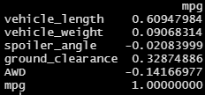

# MechaCar Statistical Analysis Using R

## Deliverable 1: Linear Regression to Predict MPG

### Overview

This analysis will attempt to identify and predict a miles per gallon (mpg)
performance provided the following parameters:

1. Vehicle Length
2. Vehicle weight
3. Spoiler angle
4. Ground Clearance
5. Drive Train (All Wheel or Standard)

A multi linear regression will be fitted to the above factors.

### Results

#### Correlation Matrix

A correlation matrix helps determine which factors may have an influence on MPG.
The only strong correlation factor is length with a value of 0.61. Ground clearance
height has a slight correlation of 0.33. This would suggest that the multi linear
regression should pick up length as having the most influence in predicting mpg.

#### Exploratory Analysis

Visual inspection of mpg vs. length suggest a relationship between mpg and vehicle
length.

The plot of mpg vs ground clearance is noisier. It is not apparent there is a relationship between mpg and ground clearance.

#### Linear Regression to Predict MPG

* Which variables/coefficients provided a non-random amount of variance to the mpg values in the dataset?

  As expected from the correlation matrix, vehicle length and ground clearance provided a non-random variance to mpg. This is determined by their p-values of 2.60e-12 and 5.21e-08 respectively. Their coefficients are most likely not 0.

* Is the slope of the linear model considered to be zero? Why or why not?

  The linear model is not 0 because length and ground clearance are not 0. Also, the overall p-value of the model is 5.35e-11. This indicates it is extremely likely that it isn't 0.

* Does this linear model predict mpg of MechaCar prototypes effectively? Why or why not?

  The effectiveness depends on the needs and requirements of the customer requesting the model. Currently, this model accounts for 68% of the variation in mpg. This means that 32% of the variation is due to other unknown factors. A plot of the predicted mpg vs the measured mpg is provided for reference.

## Deliverable 2: Summary Statistics on Suspension Coils

The following analysis will perform summary statistics on production lots of suspension coils. Ideally, the values of the suspension coils should remain the same from lot to lot.

### Summarized Data

* The design specifications for the MechaCar suspension coils dictate that the variance of the suspension coils must not exceed 100 pounds per square inch. Does the current manufacturing data meet this design specification for all manufacturing lots in total and each lot individually? Why or why not?

  If the requirement is not to exceed 100 psi, then the metric to inspect is standard deviation which would be in units of psi. Variance would be in units of psi^2.
  
  The standard deviation never exceeds 100 psi by individual lot or total. Therefore, it can be assumed that the production process is stable.

## Deliverable 3: T-Tests on Suspension Coils

This analysis will perform one sample t-test to determine if the suspension coils are statistically different from expected value of 1,500 PSI.

### T Test with all Lots Combined

This t-test had 150 data points with the following t-test results:

The mean of all lots combined is 1498.78 resulting in a p-value of 0.06028. If we use the 0.05 cutoff, we can assume that the coil PSI is 1,500.

### Lot 1 t-test

The mean for lot 1 is 1,500 resulting in a p-value of 1. Lot 1 is not statistically different from 1,500.

### Lot 2 t-test

The mean for lot 2 is 1,500.2 resulting in a p-value of 0.6072. Lot 2 is not statistically different from 1,500.

### Lot 3 t-test

The mean for lot 3 is 1,496.14 resulting in a p-value of 0.04168. This is below the 0.05 cutoff, therefore we can say that lot 3 is statistically different from 1,500.
